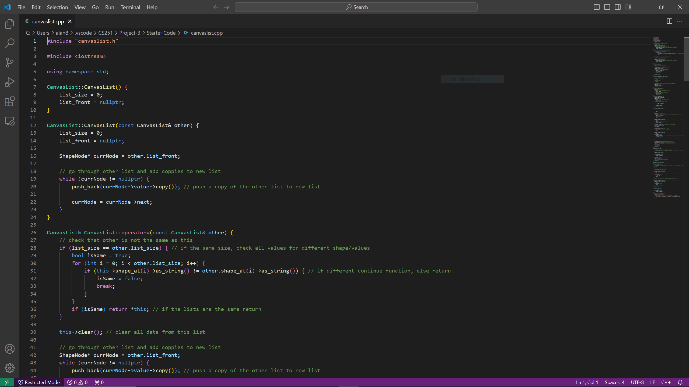

# CS251-Project3
## CanvasList - linked list of shapes

An implemented class that supports adding derived classes of the Shape class

### Included Files:

canvaslist.cpp - implementation of CanvasList's functions

canvaslist.h - definition of CanvasList's functions

canvaslist_tests.cpp - definition and implementation of test for CanvasList

shape.cpp - implementation of Shape class and its derived classes

shape.h - definition of Shape class and its derived classes

### Purpose:
The project implements a CanvasList class that represents a list of varying shapes (circles, rectangles, etc.).  The implementation uses a linked list of Shape objects with subclasses for each type of Shape that inherit the Shape class. The linked lists then takes Shape objects and with polymorphism the linked list can added and print out each shapes unique data.

### Technologies:
makefiles and Google Test where used for testing the implementation with Valgrind being used to track memory management.
